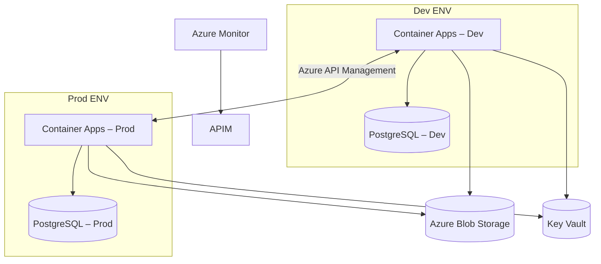

# Azure Platform Support Workflow Management System – Product Requirements Document (PRD)

## Version 1.0 – 25 Jun 2025

### Change Log

|Version|Date|Author|Notes|
|---|---|---|---|
|0.1|25 Jun 2025|ChatGPT|Initial draft|
|0.2|25 Jun 2025|ChatGPT|Simplified (no PagerDuty / HA DB)|
|0.3|25 Jun 2025|ChatGPT|Added 100 MB attachment cap, dual‑env, configurable SLA store|
|**1.0**|25 Jun 2025|ChatGPT|Finalised MVP scope; resolved open questions; ready for implementation|

---

## 1  Purpose & Background

The Azure Platform Support (APS) team needs a **single, low‑friction system** to capture two primary work types:

1. **Azure Monitor alerts** that require engineering intervention.
    
2. **Ad‑hoc internal requests** (access, new resources, standard changes).
    

Current ad‑hoc channels (email, Teams chat, spreadsheets) lack SLA tracking, ownership visibility and audit trail. The Workflow Management System (WMS) will centralise ticket intake, triage, assignment, resolution and reporting while remaining lightweight to enable rapid iteration.

---

## 2  Objectives & Success Metrics

|Objective|KPI|Target|
|---|---|---|
|**Reduce MTTA**|Avg. time from ticket creation → acknowledgment|≤ 10 min|
|**Reduce MTTR**|Avg. ticket resolution duration|25 % ↓ vs. baseline|
|**Improve SLA Compliance**|% tickets resolved within SLA|≥ 95 %|
|**Increase Transparency**|% tickets visible in real‑time board|100 %|

_SLA thresholds will be configured post‑pilot via the SLA matrix (see FR‑12)._

---

## 3  Scope

### 3.1 In‑Scope (MVP)

1. **Ticket lifecycle** – Create → Triage → Assign → Work → Resolve → Close.
    
2. **Intake channels**  
    • **Azure Monitor alerts** (webhook).  
    • **Teams bot** ("/ticket" command).  
    • **Web portal** form (access, new resource, incident).
    
3. **Basic SLA engine** – configurable per priority and category.
    
4. **Role‑based dashboards** – Kanban for engineers, SLA overview for leads.
    
5. **Attachment support** – files ≤ 100 MB stored in Azure Blob Storage.
    
6. **Audit history** – immutable timeline per ticket.
    
7. **Search & filtering** – keyword, status, priority, service.
    
8. **Dual environments** – Dev & Prod deployed from identical IaC with parameter overrides.
    

### 3.2 Out of Scope (Phase 1)

- PagerDuty/SMS paging.
    
- Third‑party ITSM sync (ServiceNow, Jira, etc.).
    
- High‑availability database / cross‑region fail‑over.
    
- Native mobile apps (responsive web only).
    
- ML‑based auto‑classification & routing.
    

---

## 4  Personas

|Persona|Goals|Pain Points|Success Indicators|
|---|---|---|---|
|**Platform Engineer**|Quickly acknowledge & resolve alerts/requests|Alert noise, context switching|Clear priority queue, low MTTA|
|**Duty Manager**|Balance workload, monitor SLA health|No single pane of glass|Real‑time queue, SLA warnings|
|**Service Owner**|Track service health KPIs|Siloed data|MTTR trend reports|
|**Auditor**|Retrieve evidence of approvals & actions|Email chains|Immutable export|

---

## 5  User Stories & Acceptance Criteria (MVP)

1. **Alert‑Driven Ticket**  
    _As_ Azure Monitor  
    _I want_ to POST an alert payload to `/api/alerts`  
    _So that_ a ticket is automatically created with severity, resource ID and description populated.  
    _Acceptance_ – 200 OK returns new ticket ID; missing auth → 401.
    
2. **Teams Bot Ticket**  
    _As_ an internal user  
    _I want_ to type `/ticket access to prod KV` in Teams  
    _So that_ a Medium‑priority Access ticket is created.  
    _Acceptance_ – Bot responds with confirmation & link.
    
3. **Kanban Assignment**  
    _As_ Duty Manager  
    _I want_ to drag a ticket to an engineer swim‑lane  
    _So that_ owner is set and notified.  
    _Acceptance_ – API `PUT /tickets/{id}/assignee` succeeds; Teams message sent.
    
4. **SLA Countdown**  
    _As_ an engineer  
    _I want_ ticket cards to warn when SLA breach is imminent (≤ 10 % buffer)  
    _So that_ I can reprioritise.  
    _Acceptance_ – Card border turns red; Teams alert.
    
5. **Attachment Upload**  
    _As_ an engineer  
    _I want_ to attach log bundles ≤ 100 MB  
    _So that_ triage is easier.  
    _Acceptance_ – 201 Created on ≤ 100 MB; > 100 MB → 413 error displayed.
    

---

## 6  Functional Requirements

|#|Requirement|Priority|
|---|---|---|
|FR‑1|REST API (`/tickets`, `/alerts`, `/users`) documented via OpenAPI|Must|
|FR‑2|Azure Monitor alert webhook endpoint|Must|
|FR‑3|Teams bot built with Bot Framework v4|Must|
|FR‑4|Web UI – React (TypeScript) + Fluent UI; Entra ID SSO|Must|
|FR‑5|Role/permission model (Viewer, Engineer, Manager, Admin)|Must|
|FR‑6|Kanban board with swim‑lanes by priority/assignee|Must|
|FR‑7|Configurable SLA engine (priority × category)|Must|
|FR‑8|Audit log export (CSV)|Should|
|FR‑9|Simple reporting page (MTTA, MTTR, open vs closed)|Should|
|FR‑10|Attachment storage ≤ 100 MB per file in Blob Storage|Must|
|FR‑11|**Environment parity** – Dev & Prod via same IaC|Must|
|FR‑12|**SLA configuration store** – JSON/DB table editable via admin UI; default placeholder values|Must|

---

## 7  Non‑Functional Requirements

|Category|Requirement|
|---|---|
|Reliability|Single‑region; daily backup; RPO/RTO ≤ 24 h|
|Performance|P95 API latency ≤ 250 ms; Portal FCP ≤ 2 s|
|Security|TLS 1.2+; Entra ID auth; secrets in Key Vault|
|Maintainability|IaC in Bicep; GitHub Actions CI/CD; ≥ 70 % test coverage|
|Observability|Structured logs & traces → Azure Monitor; metrics → Log Analytics|
|Accessibility|WCAG 2.1 AA compliance|

---

## 8  System Architecture (High Level)

_Both environments are deployed from the same Bicep modules with parameter overrides._

### Recommended SKUs (per environment)

|Component|Azure SKU|Notes|
|---|---|---|
|Ticket Service|Azure Container Apps, B1|Auto‑scale 1→3 replicas|
|PostgreSQL|Basic, 2 vCores, 10 GB|Single zone|
|API Management|Developer tier|Upgrade later|
|Storage Account|Standard LRS|Attachments, exports|
|App Insights|Basic|Logs & traces|

---

## 9  Analytics & Reporting

- **Dashboard** – MTTA, MTTR, open/closed trends, SLA breaches.
    
- **CSV export** – One‑click for auditors or external BI.
    

---

## 10  Risk Register

|Risk|Likelihood|Impact|Mitigation|
|---|---|---|---|
|SLA matrix not defined by go‑live|Med|Med|Ship editable config; define within 30 days of pilot|
|Azure Monitor schema change|Low|Med|Contract tests; schema version pinning|
|Bot message throttling|Low|Low|Retry with exponential backoff|
|Scope creep|Med|Med|MVP feature freeze until GA|

---

## 11  Dependencies

- Entra ID tenant & security groups.
    
- Azure subscriptions / resource groups for Dev & Prod.
    
- Bot Framework registration in Azure Portal.
    

---

## 12  Timeline (Lean – 7 Weeks)

|Phase|Duration|Milestone|
|---|---|---|
|Sprint 0|1 wk|Repo, CI/CD, IaC baseline; Dev & Prod provisioned|
|Sprints 1‑2|2 wks|API skeleton, DB schema, alert endpoint|
|Sprints 3‑4|2 wks|Teams bot MVP, Kanban UI basic|
|Sprint 5|1 wk|SLA engine + countdown UI|
|Sprint 6|1 wk|Reporting page, CSV export; Prod pilot|
|**Total**|**7 wks**|MVP live for APS team|

---

## 13  Open Questions

_None – all previous questions resolved for v1.0._

---

## 14  Appendix

- **Glossary** – MTTR, MTTA, SLA, APS, WMS, RCA.
    
- **Reference Docs** – Azure Monitor Alert schema, Bot Framework SDK v4, PostgreSQL Flexible pricing, Azure Container Apps docs.
    

---

### Approval

|Name|Role|Signature|Date|
|---|---|---|---|
|Dylan McCarthy|Principal Engineer & Product Owner|||
|APS Duty Manager Rep|Stakeholder|||
|Platform Engineering Lead|Stakeholder|||