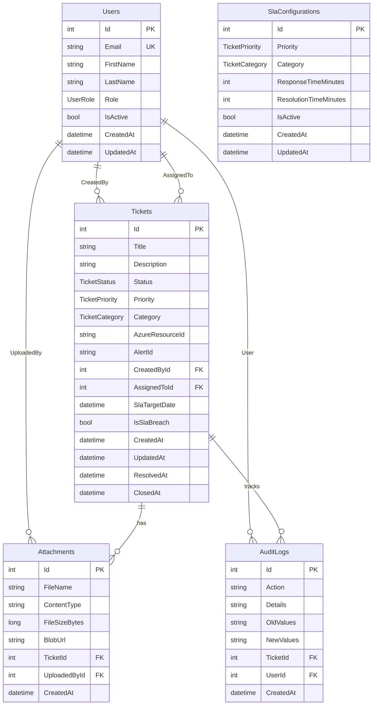

# Database Schema Design

## Entity Relationship Diagram (ERD)

## Enums

### UserRole
- Viewer (1)
- Engineer (2)
- Manager (3)
- Admin (4)

### TicketStatus
- New (1)
- Triaged (2)
- Assigned (3)
- InProgress (4)
- Resolved (5)
- Closed (6)

### TicketPriority
- Low (1)
- Medium (2)
- High (3)
- Critical (4)
- Emergency (5)

### TicketCategory
- Incident (1)
- Access (2)
- NewResource (3)
- Change (4)
- Alert (5)

## Tables Description

### Users
Stores user information including role-based access permissions.
- **Primary Key**: Id
- **Unique Key**: Email
- **Relationships**: 
  - One-to-many with Tickets (CreatedBy)
  - One-to-many with Tickets (AssignedTo)
  - One-to-many with Attachments (UploadedBy)
  - One-to-many with AuditLogs (User)

### Tickets
Core entity representing support tickets/work items.
- **Primary Key**: Id
- **Foreign Keys**: 
  - CreatedById → Users.Id
  - AssignedToId → Users.Id (nullable)
- **Relationships**:
  - Many-to-one with Users (CreatedBy)
  - Many-to-one with Users (AssignedTo, optional)
  - One-to-many with Attachments
  - One-to-many with AuditLogs

### Attachments
File attachments associated with tickets.
- **Primary Key**: Id
- **Foreign Keys**:
  - TicketId → Tickets.Id
  - UploadedById → Users.Id
- **Constraints**: FileSizeBytes ≤ 100MB

### AuditLogs
Immutable audit trail for tracking changes.
- **Primary Key**: Id
- **Foreign Keys**:
  - TicketId → Tickets.Id (nullable)
  - UserId → Users.Id

### SlaConfigurations
SLA configuration matrix by priority and category.
- **Primary Key**: Id
- **Unique Key**: (Priority, Category)
- **Constraints**: Priority and Category combination must be unique

## Default SLA Configuration

| Priority | Category | Response Time | Resolution Time |
|----------|----------|---------------|-----------------|
| Critical | Incident | 15 minutes | 4 hours |
| High | Incident | 30 minutes | 8 hours |
| Medium | Incident | 1 hour | 24 hours |
| Low | Incident | 2 hours | 48 hours |
| Critical | Alert | 10 minutes | 2 hours |
| High | Alert | 15 minutes | 4 hours |
| Medium | Access | 4 hours | 24 hours |
| Medium | NewResource | 8 hours | 48 hours |

## Indexes

- `Users.Email` - Unique index for email lookups
- `Tickets.Status` - Index for filtering by status
- `Tickets.Priority` - Index for filtering by priority
- `Tickets.AssignedToId` - Index for filtering by assignee
- `Tickets.CreatedAt` - Index for time-based queries
- `Tickets.AlertId` - Index for alert correlation
- `AuditLogs.TicketId` - Index for audit history queries
- `AuditLogs.CreatedAt` - Index for time-based audit queries
- `SlaConfigurations.(Priority, Category)` - Unique composite index